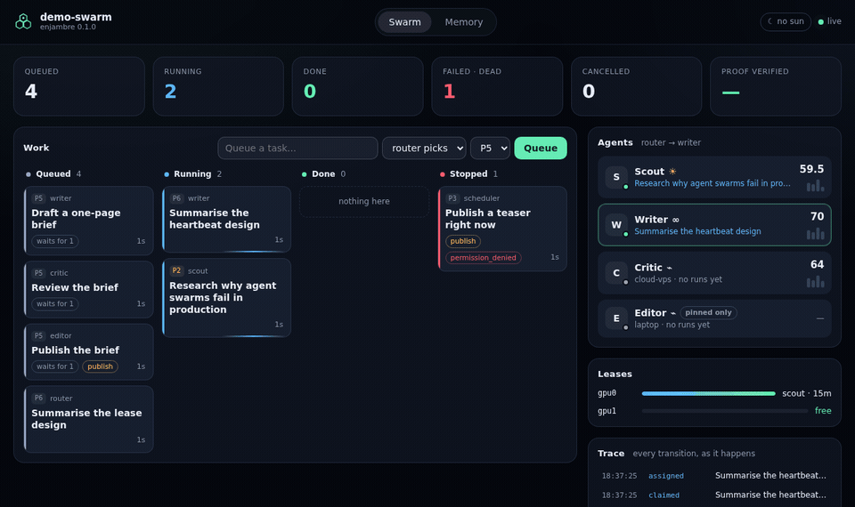
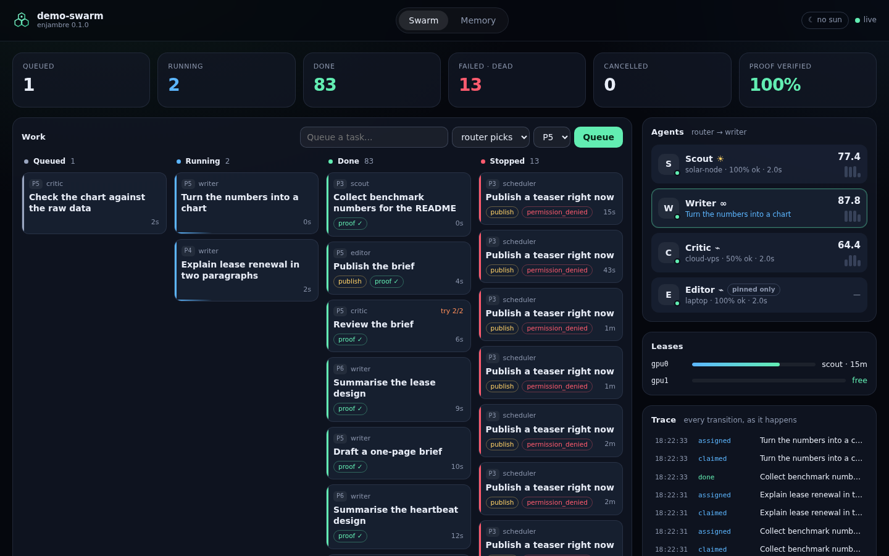
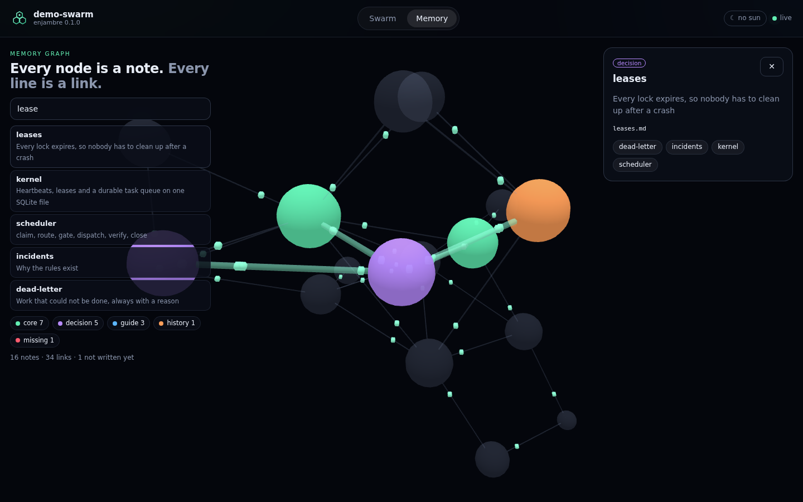

# enjambre

**A small, honest operating system for swarms of AI agents.**

*Enjambre* is Spanish for *swarm*. It takes the agents you already have (Claude Code, Codex, a
local model behind Ollama, a hosted API, your own scripts) and gives them what a team of
processes needs to work together without lying to each other: a kernel, a queue, leases, a
permission gate, a router and a shared memory you can see.

[Español](README.es.md)



```bash
pip install .            # from a clone; one dependency (PyYAML)
enjambre demo            # open http://127.0.0.1:8765
```

The demo needs no model and no API key. Four scripted agents run a small editorial pipeline:
research, draft, review, publish. The critic stumbles once so you can watch a retry. The writer
tries to publish without permission and the gate stops it before it runs. The router explains
every choice it makes.

---

## Why

Single agents are easy now. Swarms fail in boring, expensive ways:

- A worker dies holding the GPU, and nobody notices for ten hours.
- A task is reported as done, and the file it promised does not exist.
- A nightly job looks offline two thirds of the time because it only runs every 30 minutes.
- A rule written in the prompt is ignored the one time it matters.
- A failed step leaves everything downstream waiting forever.

enjambre was extracted from a real swarm that runs day and night on a solar-powered
workstation and a small cloud server. Every mechanism below exists because one of those
failures happened.

## What you get

| | |
|---|---|
| **Kernel** | One SQLite file. Processes report heartbeats and their state (*alive*, *stale*, *offline*) is derived from the age of the last one, never declared. |
| **Leases** | GPUs, API quotas, browsers: every lock expires on its own. A crashed holder cannot block anyone for long. |
| **Durable queue** | Priorities, atomic claims, idempotency keys, task leases that long jobs renew, automatic retries, a dead-letter state that always records a reason. |
| **DAG** | Tasks wait for their dependencies, receive upstream results as *data* (never as instructions), and die visibly when something upstream fails. Retrying the upstream task brings them back. |
| **Proof of delivery** | A task can declare what must exist when it is done, and agents declare artifacts. The kernel checks files, directories and URLs itself, and a file older than the task does not count. Record the verdict, or enforce it. |
| **Policy gate** | Rules travel with every prompt, and permissions are enforced in code before any agent runs. A broken edit of the policy never replaces the last good one. |
| **Router** | Picks an agent from measured success and latency, declared cost, and energy. Agents on solar power win while the sun is up. Every decision comes with a readable reason. |
| **Adapters** | `cli` for any command-line agent (no shell, isolated environment), `openai` for any OpenAI-compatible endpoint, `scripted` for demos and tests. |
| **MCP server** | Any MCP client can heartbeat, lease, claim, renew and complete tasks, check permissions and query memory. |
| **Memory graph** | A folder of markdown notes becomes a 3D graph you can explore, search and teach with. Links to notes nobody wrote yet show up in red. |
| **Dashboard** | Live board, agents, leases, trace and task timelines. No build step, no framework, strict Content Security Policy. |





## A swarm is a folder

```text
my-swarm/
├── swarm.yaml        agents, router, scheduler, kernel, memory
├── policy.yaml       rules and permissions (hot-reloaded)
├── prompts/<id>.md   the role of each agent
└── memory/           markdown notes, shown as the memory graph
```

```bash
enjambre init my-swarm     # start from the demo template
enjambre up my-swarm       # API + dashboard + scheduler
```

Put the folder in git and every change to your swarm has an author, a date and a revert.

### Bring your own agents

```yaml
agents:
  coder:
    adapter: cli
    energy: solar            # this machine runs on panels: prefer it while the sun is up
    options:
      command: ["claude", "-p"]
      env: [ANTHROPIC_API_KEY]   # the only variables the child process can see

  reviewer:
    adapter: cli
    options:
      command: ["codex", "exec", "{prompt}"]
      stdin: false               # the prompt goes in as an argument (never through a shell)
      env: [OPENAI_API_KEY]

  local:
    adapter: openai
    options:
      base_url: http://localhost:11434/v1
      model: qwen3:8b

  researcher:
    adapter: openai
    cost: 0.5
    options:
      base_url: https://openrouter.ai/api/v1
      model: deepseek/deepseek-chat
      api_key_env: OPENROUTER_API_KEY   # the name of the variable, never the key

router:
  weights: {success: 35, latency: 15, cost: 20, energy: 30}
  solar_window: {start: "09:30", end: "17:30", timezone: Europe/Madrid}
```

Agents answer with a small JSON contract (`status`, `result`, `artifacts`...). The scheduler
appends it to every prompt, together with the agent's role, the policy and the results of
upstream tasks.

### Permissions that do not depend on the model

```yaml
# policy.yaml
rules:
  - id: verify
    rule: Never report work as done without a check that passed.
operations:
  publish: [editor]          # only the editor may run tasks with operation: publish
agents:
  writer:
    forbidden: [Publishing anything yourself.]
    vetoed_operations: [publish]
```

### Join from any MCP client

```bash
# Claude Code
claude mcp add enjambre -- enjambre mcp --dir ./my-swarm

# a remote swarm started with `ENJAMBRE_TOKEN=... enjambre up --host 0.0.0.0`
claude mcp add enjambre -e ENJAMBRE_TOKEN=... -- enjambre mcp --url http://swarm-host:8765
```

```toml
# Codex (~/.codex/config.toml)
[mcp_servers.enjambre]
command = "enjambre"
args = ["mcp", "--dir", "/path/to/my-swarm"]
```

Tools: `swarm_status`, `heartbeat`, `acquire_resource`, `release_resource`, `enqueue_task`,
`claim_task`, `renew_task`, `complete_task`, `get_task`, `list_tasks`, `cancel_task`,
`retry_task`, `policy_for`, `check_permission`, `memory_query`, `memory_node`.

### Or use the kernel as a library

```python
from enjambre import AgentResult, Kernel

k = Kernel("swarm.db")
research = k.enqueue("Collect benchmark numbers", agent="scout")["id"]
chart = k.enqueue("Draw the chart", depends_on=[research], proof="/tmp/chart.png")["id"]

task = k.claim("scout")                                   # atomic
k.complete(task["id"], "scout", AgentResult.completed("numbers collected"))
k.claim("plotter")["id"] == chart                         # unblocked
```

### Command line

```text
enjambre demo | init DIR | up [DIR] | run [DIR] | mcp
enjambre enqueue "Title" --agent writer --after TASK_ID --proof /abs/path
enjambre tasks | ps | memory "query"
```

`enjambre run` processes the queue until it is idle and exits, which makes a swarm usable
from CI.

## What it is not

enjambre is not an agent framework and not a prompt library. Frameworks such as LangGraph or
CrewAI compose model calls inside one program. enjambre sits one level below: it coordinates
separate agents and processes, on one machine or several, that already know how to do their
job. You can run agents built with any framework inside it.

## Design notes

- **Honest state.** Liveness is derived, fitness is measured, and a missing measurement is
  `None`, never a decorative zero.
- **Leases everywhere.** Locks, running tasks and resources all expire. Recovery is the
  default, not a cleanup script.
- **Verification is recorded before it is enforced.** A verification gate that blocked closing
  tasks once cut a swarm's throughput by 90%. Start with `proof_mode: record`, switch to
  `enforce` when your agents declare their artifacts.
- **Data is not instructions.** Upstream results are labelled as data in every prompt.
- **Small on purpose.** Standard library plus PyYAML. One SQLite file. No build step for the UI.

Details in [docs/architecture.md](docs/architecture.md).

## Security

The API binds to `127.0.0.1` by default and refuses other addresses without `ENJAMBRE_TOKEN`.
CLI agents run without a shell and see only the environment variables you list. API keys are
read from environment variables and rejected if written into `swarm.yaml`. See
[SECURITY.md](SECURITY.md).

## Roadmap

- **Evolution loop**: the swarm proposes changes to its own genome from measured fitness, a
  human approves, and a regression triggers an automatic revert.
- **Versioned memory segments** with atomic writes and rollback per agent.
- Rate-limit buckets per provider, OpenTelemetry export, a Postgres backend for larger swarms.

## License

MIT. Made by GreenAI Network. Bundled third-party code is listed in
[THIRD_PARTY_NOTICES.md](THIRD_PARTY_NOTICES.md).
